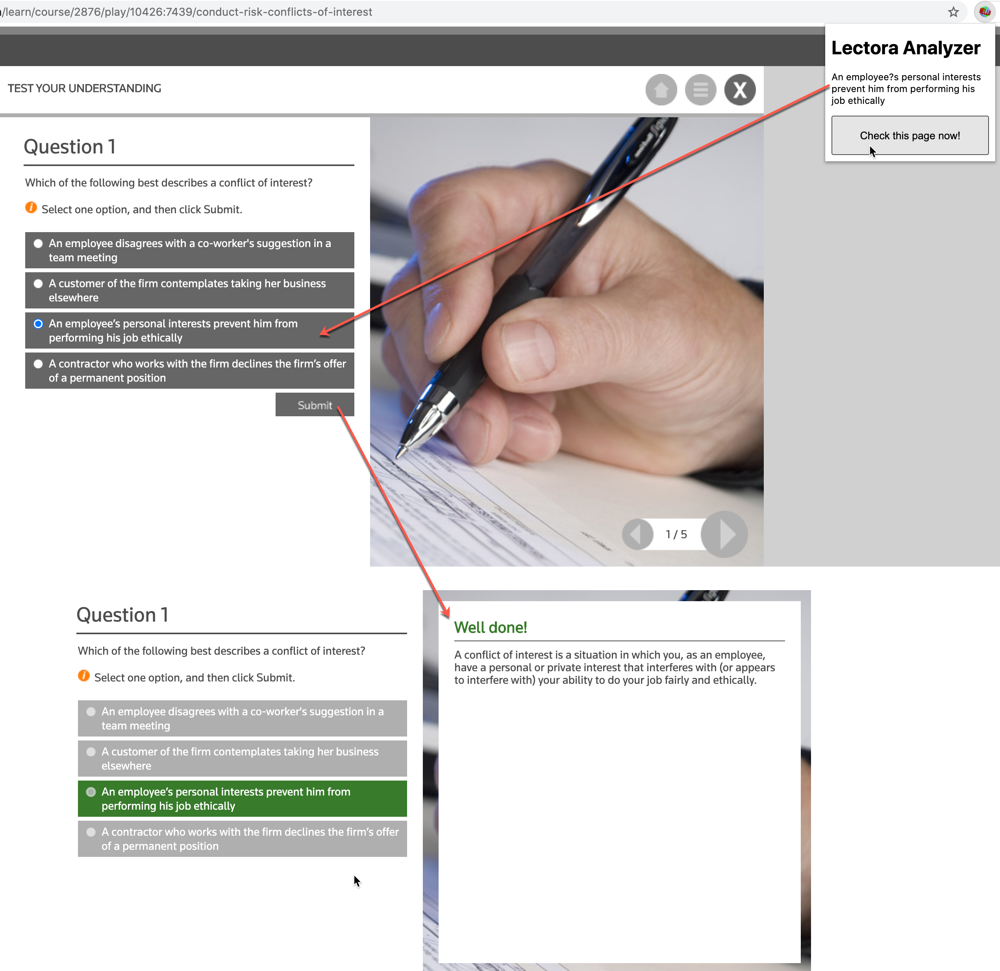
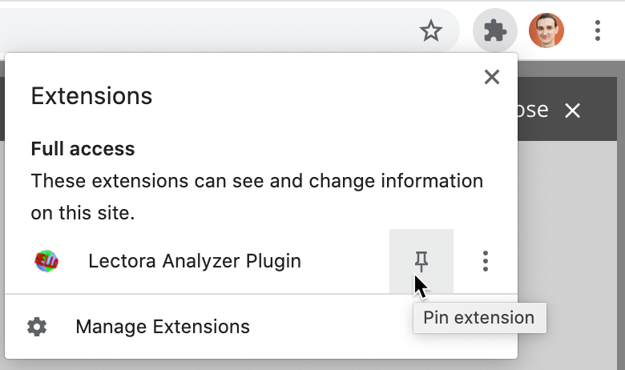

# How does it work

The plugin tries to analyze your online test which constructed by https://www.lectoraonline.com/ platform and offers proper answers.
Being on the examine page you may use key binding MacCtrl+Shift+A (for mac) and Ctrl+Shift+A in others or click on the "Check this page now!" button from plugin UI.

# How to install (manually)

1. git clone git@github.com:nhusnullin/LectoraExtension.git

2. Chrome -> More tools -> Extension

3. Turn on "developer mode" and click on "Load unpacked"

4. Select src folder from repo

5. In some cases you may need to pin extension

# Disclaimer

This plugin is provided AS IS without warranty of any kind. Keep in mind that only you is responsible for youe education and no one more. The entire risk arising out of the use of the plugin and documentation remains with you. In no event shall author be held liable for any damages whatsoever (including, without limitation, damages for loss of business profits, business interruption, loss of business information, or other pecuniary loss) arising out of the use of or inability to use the plugin or documentation. 
