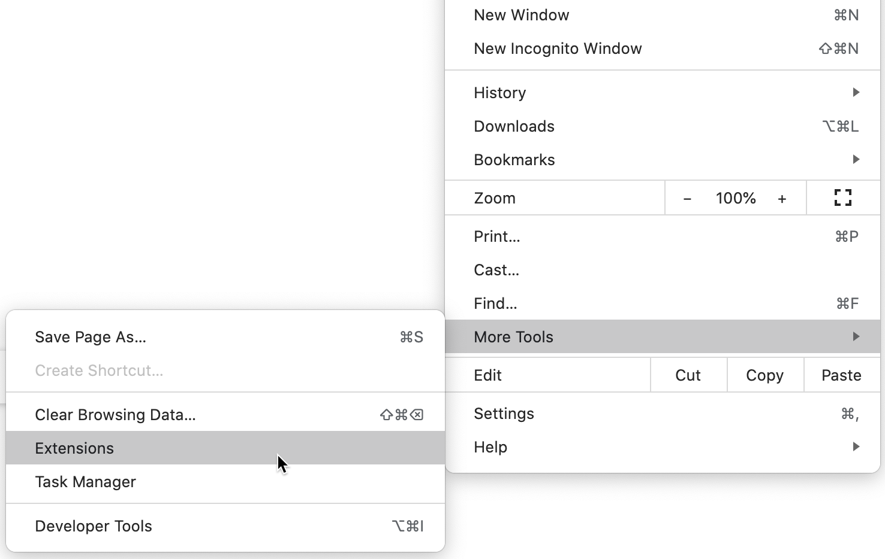
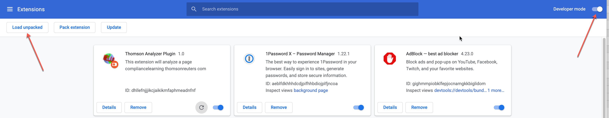
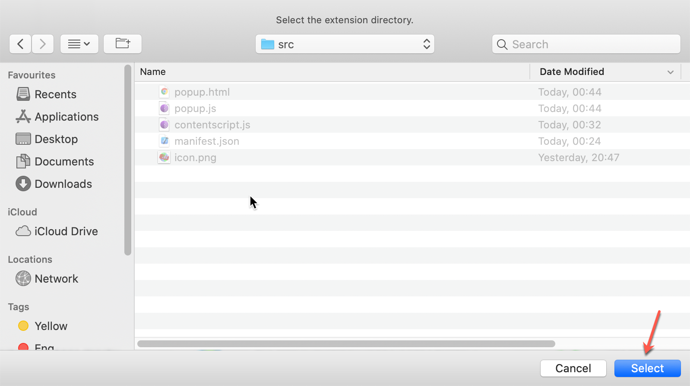

# How to install

1. git clone git@github.com:nhusnullin/PageAnalyzerChromePlugin.git
2. Chrome -> More tools -> Extension

3. Turn on "developer mode" and click on "Load unpacked"

4. Select src folder from repo

